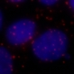
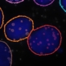

Automated Detection of PLA
===

**Version 1.0 Available**
--
2018/01/24

|||
|-------------------------------------|-----------------------------------|
|**ORIGINAL**   |**TREATED**   |

The `PLA` macro explores recursively a specific folder and treat all images with the correct extension (chosen by the user).

Input
---
For each aquistion 2 files should be provided:
- One DAPI (or any other nucleus labelling) staining.
- One PLA staining

All DAPI files should have the same explicit extension (e.g. `_w1DAPI.TIF`). It should be the same for the PLA files (e.g. `_w2RFP.TIF`). Only DAPI files with a corresponding PLA file will be treated.

As the program is able to treat files as batch, all images must have the same resolution.

Output
---  
The macro generate several files and folders that have all the same Fingerprint (Date and time).
- 1 `yyyy-mm-dd_hh-mm_Parameters_and_Files.txt` file in the root folder indicated by the user. This file contains all parameters used for the analysis, and the list of all the picture files that the macro will treat.
- 1 `yyyy-mm-dd_hh-mm_Results.csv` table file containing the properties of all Nuclei and PLA Foci detected for all images. The data are presented in the following columns:
    - `File`: File name.
    - `Nuclei`: Names of the Nuclei in the file.
    - `Surface`: Surface in pixels of the Nuclei.
    - `PLA foci`: Names of PLA Foci in one Nucleus.
    - `Surface PLA`: Total PLA surface in a Nucleus or Surface of each PLA Foci.
    - `% of Nucleus surface`: Percentage of the surface of a Nucleus covered by the total PLA Foci, or by each PLA Foci.
- 1 `yyyy-mm-dd_hh-mm_ImageName` folder containing:
    - 1 `ImageName_Bilan.jpg` file showing the identified Nuclei and PLA Foci on the original DAPI and PLA stainings.
    - 1 `ImageName_Nuclei.jpg` file showing the identified Nuclei on the original DAPI staining.
    - 1 `ImageName_PLA.jpg` file showing the identified Nuclei and associated PLA Foci on the original PLA staining.
    - 1 `ImageName_Original.jpg` file presenting the overlay of original DAPI and PLA stainings input.
    - 1 `ImageName_Nuclei.zip` ROIset file for `ImageJ`. This is the annotated ROIs of the detected Nuclei.
    - 1 `ImageName_Nuclei-PLA.zip` ROIset file for `ImageJ`. This is the annotated ROIs of the detected Nuclei directly associated with the ROIs of PLA Foci they contain.

**Authors**
--

|    ||
|-----------------------------|------------|
|**CLUET David**|     [david.cluet@ens-lyon.fr](david.cluet@ens-lyon.fr)|

**Requirements**
--
The `PLA` macro requires `ImageJ v1.49g` or higher ([Download](https://imagej.nih.gov/ij/download.html)).

**Installation**
--
The `PLA` macro requires can be automatically installed with all required files in `ImageJ` and `FIJI`. Please follow the specific instructions described below.

---
1. Open `ImageJ`.
2. Open the `src` folder of the `PLA` macro.
3. Drag the `Installation.ijm` file on `ImageJ` Menu bar to open it.
4. In the Menu bar of the macro select the `Macros/Run Macro` option.
5. The window will be closed automatically and all required files will be installed in the `ImageJ/macros/PLA` folder. The shortcut `Plugins/Macros/PLA` will be added in the Menu bar.
6. Restart `ImageJ` to refresh the Menu bar.

---
1. Open `FIJI`.
2. Open the `src` folder of the `PLA` macro.
3. Drag the `Installation_Fiji.ijm` file on `FIJI` Menu bar to open it.
4. In the console select the `Run` option.
5. All required files will be installed in the `Fiji.app/macros/PLA` folder. The shortcut `Plugins/Macros/PLA` will be added in the Menu bar.
6. Restart `FIJI` to refresh the Menu bar.

Update
---
Follow the same instructions as for the installation process. As the settings for the detection of the nuclei and the PLA foci can be modified by the user, the `Settings.txt` file will not be affected. The `Your setting file has been protected!` message will indicate your analysis parameters have been preserved.
